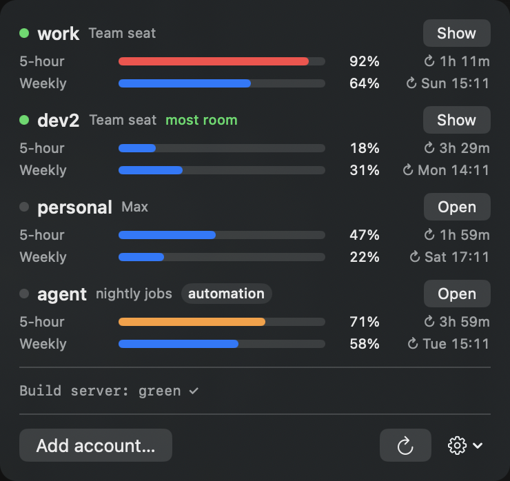

# Claude Seat Switcher

**See every Claude account's limits in your menu bar, and switch to the one with room left — without logging out.**

A free, open-source macOS menu bar app for people who use **Claude Desktop** with more than one
account: several **Claude Team seats**, a work and a personal account, or a Max plan next to a Team seat.

<p align="center"></p>

> **Unofficial.** Not affiliated with, endorsed by, or supported by Anthropic. "Claude" is a trademark of Anthropic, PBC.

## Why

You hit a usage limit in the middle of work. Today that means: guess which other account still has
room, sign out, wait for the email link, sign in again, and find your conversation. Claude Seat Switcher
removes all of that.

| Without it | With it |
|---|---|
| You find out about a limit when Claude stops answering | A notification at 90% tells you which account to move to |
| One Claude Desktop login at a time; switching means signing out | Every account has its own Claude window and stays signed in |
| Your Code-tab conversations seem to vanish after switching | Conversations are shared, so you continue where you left off |
| No idea how close each seat is to its weekly cap | Session and weekly usage for every account, with reset times |

## Features

- **Usage at a glance** — the 5-hour and weekly limits of every account (and model-specific weekly limits such as Fable), with a countdown to each reset. Polling is gentle: every 5 minutes per account, every 2 minutes for an account near its limit, and it backs off when Anthropic asks it to.
- **Limit alerts** — a notification when any limit of an account reaches 90%, naming the account with the most room left (counting weekly limits too). The menu bar turns red.
- **One window per account** — each account runs in its own Claude Desktop window and stays signed in. Click **Show** to bring it forward.
- **Shared Code-tab history** — conversations from one account appear in the others' sidebar (same organization only), so you can pick up a conversation on another seat. It never overwrites a file; undo removes only copies you have not continued in, and a conversation you delete is not copied back.
- **Automation accounts** — mark a seat used by scripts or `claude -p` jobs. It is never suggested for interactive work, and you get told when it hits its limit.
- **Custom status lines** (opt-in) — turn it on in the menu, then drop an executable script into the folder; its first output line becomes a line in the menu (build server, CI, a background worker…). Only scripts owned by you and not writable by others are run. A symlinked script gets the link's name in `STATUS_LINE_NAME`, so one script can serve several lines.
- **Compact menu bar** — by default only the gauge and the 5-hour usage of the window you are using (the fullest one if several are open), so macOS does not hide it in a crowded menu bar. Click it for every account. Turn it off in ⚙ to see account names.
- **Scales to many seats** — with names shown and 4+ accounts, the menu bar lists only your open windows and the account with the most room; idle accounts are polled less often.
- **Opens at login** — starts with your Mac (turn it off in the menu).
- **Update notice** — checks GitHub once a day and shows a download button when a new version is out (can be turned off).

## Install

Requires macOS 14 or later and Claude Desktop. Claude Code is used for signing in; if it is not
installed, the copy bundled inside Claude Desktop is used.

**Homebrew**

```sh
brew install --cask burakatmaca7/tap/claude-seat-switcher
```

**Download** — get the `.zip` from the [latest release](https://github.com/burakatmaca7/claude-seat-switcher/releases/latest), unzip, and move the app to Applications.

**Build from source** (no Gatekeeper prompt, since you build it yourself)

```sh
git clone https://github.com/burakatmaca7/claude-seat-switcher.git
cd claude-seat-switcher
./build.sh --install
```

### First launch

The app is not notarized by Apple (that needs a paid developer account), so the first time macOS says it
*"could not verify"* the app. Open **System Settings → Privacy & Security**, scroll down, and click
**Open Anyway**. You only do this once. Building from source avoids it.

## How to use

1. Click the gauge in the menu bar → **Add account…**
2. Add the account you already use in your regular Claude window first and choose *My regular Claude window*.
3. Add each extra seat with *A separate window just for this account*. A new Claude window opens — sign in there.
4. For usage data, the app opens Claude's sign-in page in your browser; approve it and paste the code back.
   Make sure your browser is signed in to claude.ai as the same account.

Right-click an account to mark it as an automation account or remove it (close its window first).

**Tip:** if the email sign-in link opens the wrong Claude window, use the code from the email or *Continue with Google* instead.

## How it works

- **Separate windows:** Claude Desktop accepts a `--user-data-dir` argument. Each extra account gets its own profile folder under `~/Library/Application Support/ClaudeSeatSwitcher/DesktopProfiles/`, so its sign-in lives only there.
- **Usage data:** each account is signed in once to its own Claude Code profile (`CLAUDE_CONFIG_DIR`). Claude Code stores that sign-in in your login Keychain. The app reads it and asks Anthropic's usage endpoint for the percentages.
- **Shared history:** Claude Desktop lists Code-tab sessions from small JSON files per account. The app copies missing files between accounts of the same organization. Transcripts are not copied; Claude already keeps them in one shared place.

## Privacy and security

These are rules, not aspirations. A change that breaks one of them will not be merged.

1. **Everything runs on your Mac.** No server, no account, no analytics, no telemetry.
2. **Your sign-ins never leave your Mac** except to Anthropic, to read usage and to refresh sign-ins the app created.
3. **Every HTTP request the app makes is in one file:** [`Network.swift`](Sources/ClaudeSeatSwitcher/Network.swift). Redirects are refused, so a token can never be forwarded to another host. The complete list:
   - `api.anthropic.com/api/oauth/usage` — read usage
   - `platform.claude.com/v1/oauth/token` — refresh a sign-in this app created
   - `api.github.com/repos/burakatmaca7/claude-seat-switcher/releases/latest` — daily update check, no data sent (can be turned off)
4. **Tokens stay in the Keychain:** never written to files, never logged, never passed on a command line. Keychain writes go through stdin, hex-encoded, and are verified by reading back.
5. **Your default Claude Code login is never refreshed or modified**, so other tools using it are never signed out.
6. **History sharing never overwrites.** Every copy is journaled with its hash; undo only moves unchanged copies to the Trash.
7. **Removing an account** deletes only what the app created: its window profile (to the Trash) and its own sign-in for usage data.

**Good to know:** Claude Code stores its sign-ins in your login Keychain in a way that any program running as
you can read. That is how Claude Code works, not something this app adds — but it is a reason to only run
software you trust. Do not point other tools at the app's own sign-in profiles (under
`~/Library/Application Support/ClaudeSeatSwitcher/CLIProfiles/`): two programs refreshing the same sign-in can sign it out.

Found a problem? See [SECURITY.md](SECURITY.md).

## FAQ

**Is using several accounts allowed?** That depends on your plan and Anthropic's terms. Team seats are
assigned to people; check with your workspace owner. This app only shows usage and opens windows — it does
not bypass any limit.

**Does it work on Windows/Linux?** No. Claude Desktop runs on macOS and Windows; this app is macOS-only.

**I work in the terminal, not Claude Desktop.** Try [claude-swap](https://github.com/realiti4/claude-swap), which switches Claude Code CLI accounts.

## Credits

Built on ideas from [guise](https://github.com/siddhjagani/guise) (one Claude Desktop profile per account),
[meld](https://github.com/siddhjagani/meld) (shared session history),
[claude-swap](https://github.com/realiti4/claude-swap) and [CodexBar](https://github.com/steipete/CodexBar)
(usage tracking). No code was copied from them.

## License

[MIT](LICENSE)
